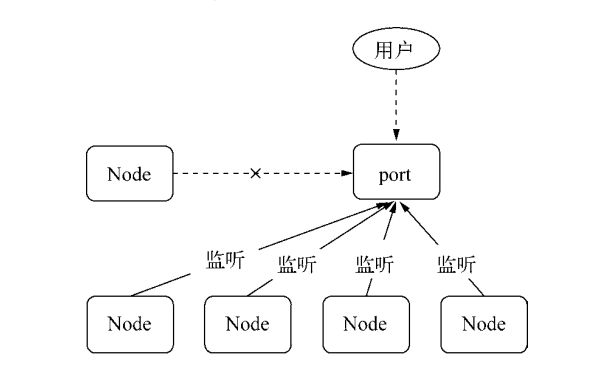

## 一 Node进程间通信演示

在Master-Worker模式中，如果要实现主进程管理和调度，就需要主进程与工作进程之间通信。HTML5规范中，WebWorker雷公了工作线程与主进程通信的方法，Node与该方式相似。  

创建master.js：
```js
var cp = require('child_process');

var childP = cp.fork('./worker.js');

childP.on("message", function(msg){
    console.log("master get：", msg);
});

childP.send({
    name: "father"
});
```

创建worker.js：
```js
process.on("message", function(msg){
    console.log("worker get: ", msg);
})

process.send({
    name: "child"
})
```

启动：
```
node master.js
```

## 二 进程间通信原理

进程间通信 Inter-Process Communication 简称IPC。其目的是为了让不同的进程能够互相访问资源并进行协调工作。进程间通信的实现方式很多，如：命名管道、匿名管道、socket、信号量、共享内存、消息队列等。  

Node中进程间通信的实现依靠的是底层的libuv提供的一层类似管道的抽象，该抽象在Linux上采用Unix Domain Socket实现，在Win上通过命名管道实现。  

  

父进程在实际创建子进程之前，会创建IPC通道并监听它，然后才真正创建出子进程，并通过环境变量（NODE_CHANNEL_FD）告诉子进程这个IPC通道的文件描述符。子进程在启动的过程中，根据文件描述符去连接这个已经存在的IPC通道，从而完成父子进程之间的连接：  

    

建立连接之后的父子进程可以进行自由通信，因为Node使用的是Domain Socket，与网络Socket非常相似，属于双向通信，而且是在内核中直接完成了进程间通信，无需网络层，非常高效。在Node中，IPC通道被抽象为了Stream对象，调用send()时会发送数据（类似write()），接收到的消息会通过message事件触发给应用层。  

注意：子进程为Node进程时，子进程才能根据环境变量去连接IPC通道，进行通信，除非其他进程按照约定去连接这个已经创建好的IPC通道。

## 三 句柄传递

### 3.1 句柄概念

在fork Node的web服务进程时，并没有指定端口，一旦指定端口，将会出现只有一个工作进程能够正常监听端口，其他工作进程会抛出端口已被占用的错误，无法复制出子进程。  

上述为问题的解决方式一般是：主进程监听主端口，负责接收所有的请求，然后再将这些请求分别代理到不同的端口的工作进程上。  

   

这里会暴露一个问题：主进程每接收到一个连接，就会创建一个新的文件描述符，并将请求负载（代理）到某个工作进程，文件描述符在操作系统中是有限的（双倍浪费！）。Node为了解决该问题，在send()方法中额外提供了第二个可选参数：句柄。  
```js
child.send(message, [sendHandle])
```

句柄就是一种用来标识资源的引用，它的内部包含了指向对象的文件描述符，所以句柄可以用来标识一个服务端socket对象、一个UDP套接字、一个管道等。  

在代理方案中，主进程接收到socket请求后，不再重新与工作进程之间创建新的socket连接来转发数据，而是直接将这个socket传递给工作进程！  

### 3.2 句柄示例

主进程：
```js
var cp = require('child_process')

var child = cp.fork('child.js');

var server = require('net').createServer();

server.on('connection', function (socket) {
    socket.end('handled by parent\n');
});

server.listen(1337, function () {
    child.send('server', server);
});
```

子进程：
```js
process.on('message', function (msg, server) {
    if (msg === 'server') {
        server.on('connection', function (socket) {
            socket.end('handled by child\n');
        });
    }
});
```

在该示例中，直接将一个TCP连接发送给了子进程，启动方式如下:
```
# 启动
node master.js

# 新建命令行，发送请求，会发现主进程与子进程进来来回切换处理请求
curl "http://127.0.0.1:1337/"
curl "http://127.0.0.1:1337/"
curl "http://127.0.0.1:1337/"
curl "http://127.0.0.1:1337/"
```

### 3.3 测试将服务发送给多个子进程

master.js 如下：
```js
var cp = require('child_process')

var child1 = cp.fork('child.js');
var child2 = cp.fork('child.js');

var server = require('net').createServer();

server.on('connection', function (socket) {
    socket.end('handled by parent\n');
});

server.listen(1337, function () {
    child1.send('server', server);
    child2.send('server', server);
});
```

子进程打印出pid：
```js
process.on('message', function (msg, server) {
    if (msg === 'server') {
        server.on('connection', function (socket) {
           socket.end('handled by child, pid is ' + process.pid + '\n');
        });
    }
});
```

再次测试：
```
# 启动
node master.js

# 新建命令行，发送请求，会发现主进程与子进程进来来回切换处理请求
curl "http://127.0.0.1:1337/"
curl "http://127.0.0.1:1337/"
curl "http://127.0.0.1:1337/"
curl "http://127.0.0.1:1337/"
```

此时出现的结果中，父进程、两个子进程都有可能在处理业务

### 3.4 切换到HTTP

现在可以测试父进程的YCP服务在发送完句柄后直接关闭，并且让子进程启动一个HTTP服务来处理实际业务。  

master.js 在传递出句柄后，直接关闭：
```js
var cp = require('child_process')

var child1 = cp.fork('worker.js');
var child2 = cp.fork('worker.js');

var server = require('net').createServer();

server.listen(1337, function () {
    child1.send('server', server);
    child2.send('server', server);
    server.close();     // 关闭服务
});
```

child.js 使用http模块处理业务：
```js
var http = require('http');

var server = http.createServer(function (req, res) {
    res.writeHead(200, {'Content-Type': 'text/plain'});
    res.end('handled by child, pid is ' + process.pid + '\n');
});

process.on('message', function (msg, tcpSocket) {
    if (msg === 'server') {
        tcpSocket.on('connection', function (socket) {
            server.emit('connection', socket);
        });
    }
});
```

再次启动测试，此时所有的请求都是由子进程进行处理了。在整个服务中，发生了一次转变：  

主进程将请求发送给工作进程：  

   

主进程发送完句柄并关闭监听后：  

   

此时多个子进程就可以同时监听相同的端口，没有端口重复监听的异常了。

## 四 句柄原理

目前子进程对象send()方法可以发送的句柄类型有：
- net.Socket:TCP套接字
- net.Server:TCP服务器，可以是任意建立在TCP服务商应用服务
- net.Native:C++层面的TCP套接字或者IPC管道
- dgram.Socket:UDP套接字
- dgram.Native:C++层面的UDP套接字

send()方法在讲消息发送到IPC管道前，将消息组装成2个对象，一个是参数handle，另外一个message，message参数如下：
```json
{
    cmd: 'NODE_HANDLE',
    type: 'net.Server',
    msg: message
}
```

发送到IPC管道中的实际上是我们要发送的句柄文件描述符，即一个整数值。以发送TCP服务器句柄为例，子进程收到消息后还原过程如下：
```js
function(message, handle, emit){
    var self = this;
    var server = new net.Server();
    server.listen(handle, function(){
        emit(server);
    });
}
```

在上述代码中，子进程根据message.type创建对饮的TCP服务器对象，然后监听到文件描述符上，由于底层细节不被应用层感知，所以在子进程中，开发者有一种服务器就是从父进程中直接传递过来的错觉。注意：Node进程组回见只有消息传递，不会真正传递对象，错觉是封装的结果，消息在发送时候序列化为字符串，接收到后再反序列化为对象。  

