## 一 V8简介

V8引擎是Chrome浏览器内部的JavaScript解释引擎，同样也是Node内部的JS解释器。V8对内存做了一部分限制，使得Node无法直接操作大内存对象，64位系统下约为1400MB，32位系统下约为700MB。在单个Node进程中，计算机的内存资源无法得到充足的使用。  

这是因为V8的这套内存管理机制是针对浏览器而设计的，这样的内存需求在前端页面中使用起来绰绰有余（因为每个网页选项卡都是一个v8实例），而在服务端开发，则在一些场合捉襟见肘。  

## 二 V8的内存分配

查看内存使用信息：
```js
var mem = process.memoryUsage();
console.log(mem)
```

输出样例：
```js
{ rss: 20824064,
  heapTotal: 7159808,           // 堆内存已申请到空间
  heapUsed: 4270176,            // 堆内存当前使用量
  external: 8224 }
```

堆的大小会随着存储的对象变多，而逐步申请新空间，增大容量，直到堆的大小超过V8的限制为止。表面上看，V8对内存的限制是因为浏览器不需要使用大内存，深层原因是其实V8的垃圾回收机制限制。  

1.5GB堆内存的回收，V8需要耗时50ms以上，而做一次非增量的垃圾回收需要1s以上，这是垃圾回收中引起JS线程暂停执行的时间，这样的时间暂停会严重影响服务器响应能力。所以v8直接选择限制大内存使用，就可以快速避免GC导致的JS线程暂停时间过长问题。  

当然V8也提供了打开内存限制的配置，Node在启动时可以传递 `--max-old-space-size` 或 `--max-new-space-size` 来调整内存限制大小：
```
node --max-old-space-size=1700 app.js       // 单位为MB
node --max-new-space-size=1024 app.js       // 单位为KB
```

## 三 V8的垃圾回收机制

### 1.1 v8的垃圾回收算法

v8的垃圾回收策略基于分代式垃圾回收机制。因为不同的对象，其生存周期长短不一，一种垃圾回收算法不能完全应对所有情况，所以现在垃圾回收算法会按对象的存货时间将内存的垃圾回收进行不同的分代，然后分别对不同非带的内存使用更高效的算法。  

V8将内存设置为了2个分代，V8堆的整体大小就是这2个分代所用的内存之和：
- 新生代：`--max-new-space-size` 参数就是设置新生代空间的最大值。
- 老生代：`--max-old-space-size` 参数就是设置老生代空间的最大值。

贴士：上述参数需要在Node启动时添加，即无法在启动后根据使用情况自动扩充，当内存分配中超过极限值，就会引起进程错误。  

### 1.2 新生代回收

新生代垃圾回收算法是Scavenge，而该算法的真正实现是Cheney算法，Cheney采用复制的方式实现垃圾回收。
新生代堆内存被一分为二，都称呼为semispace：
- From空间：处于使用中
- To空间：处于闲置状态

在分配对象说会，现在From空间进行分配，开始GC时，会检查From空间的存活对象，这些存活对象将被复制到To空间中，而非存活对象占用的空间将会被释放。完成复制后，From空间和To空间的角色发生互换。简单来说，GC就是通过将存活对象在两个semispace空间进行复制。  

从上看出，Scavenge算法的理论中，只能使用堆内存中的一半，但由于只会复制存活的对象，而且生命周期短的场景中存活对象往往是少部分，所以该算法仍然有很大的效率。这也是典型的牺牲空间换取时间的算法，所以无法大规模应用到所有垃圾回收过程中，只适合新生代，因为新生代对象的生命周期很短。  

如图所示：  

  

### 1.3 新生代晋升到老生代

当一个对象经过多次复制依然存活时，它会被认为是生命周期较长的对象，随后会被迁移到老生代中，这就是晋升。   

晋升的条件是下列条件之一：
- 对象是否经过Scavenge回收
- To空间的内存占用比超过限制（25%）。因为Scavenge回收完成后，To空间转变为From空间，接下来内存分配在该空间进行，占比过高会影响后续内存分配

    

    

### 1.4 老生代回收

老生代中存活对象占比大，使用Scavenge会有2个问题：复制存活对象效率降低，也会出现一半空间浪费。所以V8在老生代使用的是Mark-Sweep和Mark-Compact相结合的方式进行垃圾回收。  

Mark-Sweep：即标记清除，分为标记、清除2个阶段，该算法与Scavenge的区别是：
- 不会将内存划分为两半，所以不会造成内存空间浪费
- Scavenge只复制活着的对象，Mark-Sweep只清理死亡的对象。该算法标记时会遍历堆中所有对象，并标记活着的对象，在随后的清除阶段，只清除没有被标记的对象。

活对象在新生代占据较小部分，死对象在老生代只占据较小部分，这就是两个算法不同的缘由。  

Mark-Sweep的问题：在进行一次标记清除后，内存会出现不连续的情况，在后续如果要分配一个较大的对象内存时，这些碎片空间都无法完成此次分配，就需要提前触发垃圾回收，而这次回收其实是不必要的，如图所示，灰色部分为死对象：  

    

Mark-Compact：是由Mark-Sweep演变而来的，用于解决上述碎片问题。他们的差别是在对象被标记位死亡后，在整理过程中，将活着的对象往一端移动，移动完成后，直接清理掉边界外的内存，如图所示完成标记并移动存活对象后的示意图，蓝色格子为存活对象，深色格子为死亡对象，浅色格子为存活对象移动后扣下的空洞。  

   

上图中，完成移动后直接清除最右边的存活对象后面的内存区域完成回收。  

### 1.5 三个算法对比

| 回收算法 | 速度 | 空间开销 | 是否移动对象 |   
| -- | -- | -- | -- |  
| Mark-Sweep | 中等 | 少，有碎片 | 否 |  
| Mark-Compact |  最慢 | 少，无碎片 | 是 | 
| Scavenge | 最快 | 双倍空间，无碎片 | 是 | 

V8主要使用Mark-Sweep，在空间不足以对从新生代中晋升过来的对象进行分配时，才使用Mark-Compact。  

### 1.6 增量标记


