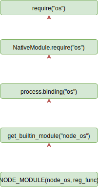

## 一 文件模块编译

###  1.1 编译过程简述

在Node中，每个文件模块都是一个对象，其定义如下：
```js
function Module(id, parent){
    this.id = id;
    this.exports = {};
    this.parents = parents;
    if (parent && parent.children) {
        parent.children.push(this);
    }
    
    this.filename = null;
    this.loaded = false;
    this.children = [];
}
```
文件在引入后，将会进行编译与执行，Node在定位到具体文件后，会新建一个模块对象，根据路径载入并编译，对不同扩展名的文件，载入方法不同：
- .js文件：通过fs模块同步读取文件后编译执行
- .node文件：该模块是使用C、C++编写的扩展文件，通过 `dlopen()`方法加载最后编译生成
- .json文件：通过fs模块同步读取文件被当做js文件载入
- 其他扩展名文件：都被当做js文件载入，Node推荐将其其他文件都编译为JS文件后再引入，这样可以减少Node不必要的编译过程

通过如下代码可以得到加载执行方式：
```js
console.log(require.extensions);

// 输出： { '.js': [Function], '.json': [Function], '.node': [Function] }
```

每一个编译成功的模块都会将其文件路径作为索引缓存在`Module._chache`对象上，以提高再次引入的性能。

###  1.2 JS模块

在Node中，可以直接使用`__dirname`、`require`等默认API，是因为在编译时，Node会对JS文件内容进行头尾包装：
```js
// 在头部添加
(function (exports, require, module, __filename, __dirname) { \n

// 在尾部添加
\n });
```

如下所示，一个普通的JS文件被包装为：
```js
(function (exports, require, module, __filename, __dirname) { 

    var a = 3;
    exports.add = function(num1, num2){
        return num1 + num2
    }

});
```

通过上述包装，每个模块文件之间实现了作用域隔离，包装之后的代码通过vm原生模块的`runInThisContext()`方法执行，返回具体的函数对象。

###  1.3 C++模块编译

C++模块是指.node扩展名的文件，这些文件都是已经经过C++模块编译后生成的，所以无需编译，直接会被 `process.dlopen()`方法进行加载和执行，该方法由libuv提供（在win和linux实现不同）。

## 二 核心模块编译

Node的核心模块都会被编译为二进制可执行文件，核心模块分为C/C++编写、JavaScript编写两种实现方式。C/C++实现的文件位于Node项目的src目录下，JavaScript文件位于lib目录下。  

Node在进行编译C/C++文件前，会先将所有JavaScript模块文件通过v8附带的 js2c.py 工具编译为C/C++代码。此时所有内置的JS代码，如（src/node.js和lib/*.js）会被转换为C++里的数组，生成 node_natives.h 文件，JS代码以字符串形式存储在一个叫做node的命名空间中，此时代码自然也是不可执行的。  

使用C/C++编写的内建模块有：buffer、crypto、evals、fs、os等模块。这些内建模块都会通过NODE_MODULE宏将模块定义到node命名空间中，位于`node_module_list`数组中。如果要使用这些模块，Node提供了`get_builtin_module()`方法可以从这个数组中取出这些模块。  

内建模块不推荐使用文件模块直接调用，Node在启东时，会生成一个全局变量process，并提供Binding()方法来协助加载内建模块。Binding()的实现位于`src/node.cc`中。

   

原生模块的引入流程： 

   