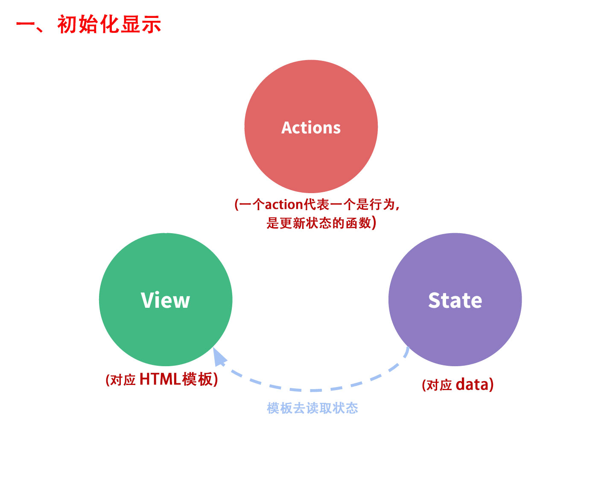
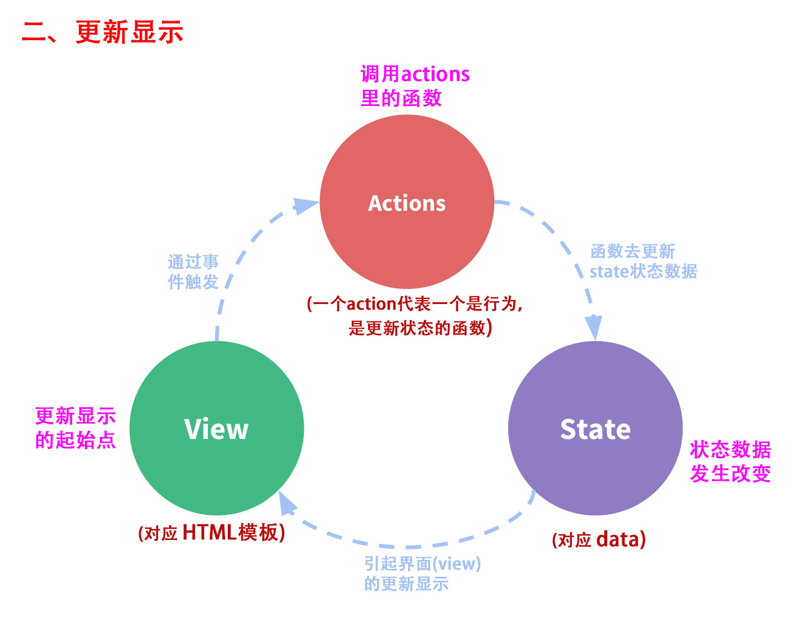

##  1、 vuex相关概念
### 1.1 vuex是什么？

vuex是vue的一个插件；是对vue应用中多个组件的共享状态进行集中式的管理（读/写）；

###  1.2 什么是“状态管理模式”？

状态自管理应用包含以下几个部分：
+ state——驱动应用的数据源；
+ view——以声明方式将 state 映射到视图；
+ actions——响应在 view 上的用户输入导致的状态变化(包含n个更新状态方法)。

```js
new Vue({
  // state
  data () {
    return {
      count: 0
    }
  },
  // view
  template: `
    <div>{{ count }}</div>
  `,
  // actions
  methods: {
    increment () {
      this.count++
    }
  }
})

```


**更新显示有两种：**
+ 初始化显示；
+ 更新显示；

初始化显示：模板需要去读取状态


更新显示：起始点在view的模板界面上，通过事件，触发后，调用actions里的函数，actions里的函数去更新state状态数据，状态数据发生改变会引起界面(view)的更新显示。

  

### 1.3 多组件共享状态问题

+ 多个视图依赖于同一个状态
+ 来自不同视图的行为需要变更同一个状态
+ 以前的解决方法：

      a、将数据以及操作数据的行为都定义在父组件；
      b、将数据以及操作数据的行为传递给需要的各个组件（有可能需要多级传递）；
+ vuex是用来解决这些问题的；
  

## 2 vuex的核心概念和API

### 2.1 state
+ vuex 管理的状态对象,里面会包含一些具体的状态。
+ 它应该是唯一的
```js
  const state = {
    xxx: initValue
  }
  
```
### 2.2 mutations
+ 包含多个直接更新 state 的方法（回调函数）的对象；
+ 谁来触: action 中的 commit(mutation名称)；
+ 只能包含同步的代码，不能写异步的代码；
  ```js
  const mutations = {
    yyy(state,date){
      // 更新state的某个属性
    }
  }
  ```

### 2.3 actions
+ 包含多个事件回调函数的对象,通过组件来触发；
+ 通过执行 commit()来触发mutation的调用，间接更新state；
+ 谁来触发：组件中：$store.dispatch('action 名称')；  // 'zzz'
+ 可以包含异步代码（定时器，ajax）
+ backend Api
  ```js
  const actions= {
    zzz({commit,state},data1){
      commit('yyy',data2)
    }
  }

  ```

### 2.4 getters
+ 包含多个计算属性（get）的对象
+ 谁来读取：组件中$store.getters.xxx
  ```js
    const getters = {
      mmm(state) {
        return ... 
      }
    }
  ```
### 2.5 modules
+ 包含多个module
+ 一个module 是一个store的配置对象
+ 与一个组件对应（包含有共享数据）

## 3 运行过程
+ 组件读状态显示：

    a、直接读取；

    b、对数据进行处理后再读取；

+ 在组件中，通过 dispatch 去触发 action调用；
+ 在action里面，通过commit 来触发 mutations 调用；

    a、在actions里，可以请求后台数据；
+ 在 mutations 里，直接去更新 state；
+ state 更新 components 组件就会渲染；
### 


##  4 用法
### 4.1 向外暴露 store 对象
```js
  export default new Vuex.Store({
    state,
    mutations,
    actions,
    getters
  })
```
### 4.2 组件中
```js
  import {mapState,mapGetters,mapActions} from 'vuex'

  export default{
    computed: {
      ...mapState(['xxx']),
      ...mapGetters(['mmm']),
    }
    methods:mapActions(['zzz'])
  }
  {{xxx}}{{mmm}}@click='zzz(date)'
```
### 4.3 映射

 Store对象创建好了之后需要映射配置：
 ```js
    import Store from './store'

    new Vue({
      Store,
    })
 ```

### 4.4 Store对象
+ 所有用vuex管理的组件中都多了一个属性 $store，它就是一个store对象
+ 属性：

    state：注册的state对象

    getters：注册的getters对象

+ 方法：
  
    dispatch(actionName,data) ： 此方法会触发action调用（分发调用 action）


## 5 使用案列

### 5.1 创建 store 对象
``` js
  //  文件store.js

  import Vue from 'vue';
  import Vuex from 'vuex';

  Vue.use(Vuex);

  // 包含多个状态对象
  const state = {  // 初始化状态
    count:0
  }

  // 包含多个getter计算属性函数的对象
  const getters = {   // 不需要调用，只需要读取属性
    evenOrOdd(state){
      return state.count%2 === 0?'偶数':'奇数';
    }
  }

  // 包含多个更新state函数的对象
  const mutations = {  // 一个mutation是一个函数
    // 增加的mutation
    addMutation(state){
      state.count++;
    },

    // 减少的mutation
    delMutation(state){
      state.count--;
    }
  }

  // 包含多个事件回调函数的对象
  const actions = {
    // 增加的action
    addAction({commit}){
      commit('addMutation');
    },
    // 减少的action
    delAction({commit}){
      commit('delMutation');
    },
    // 带条件的action
    addOddAction({commit,state}){
      if(state.count%2 === 0){
        // 增加的action
         commit('addMutation');
      }
    },
    // 异步的action
    addAcyncAction({commit}){  // 在action里面直接可以执行异步代码
      setTimeout(()=>{
        // 增加的action
        commit('addMutation');
      },1000)
    }
  }


  // 注意：真正写项目的时候，上面声明的这些对象都会写在单独的文件里面，相互之间是隔离的，


  export default new Vuex.Store({
    state,  // 包含多个状态对象
    mutations,  // 包含多个更新state函数的对象
    actions,   // 包含多个事件回调函数的对象
    getters,  // 包含多个getter计算属性函数的对象
  })


```


### 5.2 映射 store 对象
```js
  // 文件 main.js

  import Vue from 'vue'
  import App from './app'
  import store from './store'

  new Vue({
    el:'#app',
    components:{App},
    template:'<App>',
    store     // 所有的组件对象都多了个属性：$store, 也就是多了个store对象
  })
```
### 5.3 组件内使用 store 对象

```html
  // 文件 app.vue

  <template>
    <div>
      <p>{{$store.state.count}},count is {{addOddFn}}</p>
       <p>{{addAcyncFn}}</p>
      <button @click="addFn">+</button>
      <button @click="delFn">-</button>
      <button @click="addOddFn">偶数加1</button>
      <button @click="addAcyncFn">异步加1</button>
    </div>
  </template>

  <script>
    export default {
      computed:{
        evenOrOdd(){
          return  this.$store.getters.evenOrOdd;  
        }
      },
      methods:{
        addFn(){
          // 通知vuex去增加
          this.$store.dispatch('addAction');  // 触发store中对应的action调用
        },
        delFn(){
          // 通知vuex去减少
          this.$store.dispatch('delAction'); 
        },
        addOddFn(){
          this.$store.dispatch('addOddAction'); 
        }
        ,
        addAcyncFn(){
          this.$store.dispatch('addAcyncAction'); 
        }
      }
    }
  </script>

  <!-- 注意：在模板里面不需要写：this.$store，直接写$store；而在js里面则需要写成：this.$store -->

```

### 5.4 组件内使用store对象 进行优化
上面 app.vue文件 里面的组件，在使用store对象的时候有很多重复的代码，如：
    
    ‘this.$store.getters’、
    ‘this.$store.dispatch’、
    ‘this.$store.state’

我们可以在组件使用store对象的时候进行优化，让代码看起来更简洁，同时不需要在模板里面再去操作state了（如：$store.state.count）：

```html
<template>
  <div>
    <p>{{count}},count is {{addOddFn}}</p>
    <p>{{addAcyncFn}}</p>
    <button @click="addFn">+</button>
    <button @click="delFn">-</button>
    <button @click="addOddFn">偶数加1</button>
    <button @click="addAcyncFn">异步加1</button>
  </div>
</template>

<script>
  import {mapState,mapActions,mapGetters} from 'vuex';  // 此处的map是映射的意思
  export default {
    computed:{
      ...mapState(['count']),   
      ...mapGetters(['evenOrOdd']),
    },
    methods:{
      ...mapActions({  
          addFn:'addAction',  
          delFn:'delAction', 
          addOddFn:'addOddAction', 
          addAcyncFn:'addAcyncAction', 
      })

      // 此处 mapActions() 的参数如果写成数组的话，里面的元素命名必须是： 事件函数名和actions里对应的函数名相同；
    }
  }

  
</script>
```

**小贴士：**
+ mapState()、mapGetters()、mapActions()返回值是对象；
  
    返回值的代码解释为：
```js

    // ...mapGetters(['evenOrOdd']) 
    {evenOrOdd(){
      return this.$store.getters['evenOrOdd'];
    }}

```

### 6 vuex结构分解

在实际项目中，vuex里面的几个对象会单独分解成几个单独的js文件，结构如下：

    store文件夹：
        |
        |
        ——> index.js
        |
        |
        ——> state.js
        |
        |
        ——> getters.js
        |
        |
        ——> mutation-types.js
        |
        |
        ——> mutations.js
        |
        |
        ——> actions-types.js


1、组件文件：
```html
  <template>
    <div>
        <p>数字为：{{$store.state.count}} ，此数字是{{evenOrOdd}}</p>
        <p>操作：
            <button @click="addFn">加1</button>
            <button @click="delFn">减2</button>
            <button @click="addOddFn">偶数加1</button>
        </p>
    </div>
</template>

<script>
    import {mapState, mapGetters, mapActions} from 'vuex';
    export default {
        computed:{
            ...mapState(['count']),
            ...mapGetters(['evenOrOdd']),
        },
        methods: {
            delFn(){
                this.$store.dispatch('delAction',2);
            },
            ...mapActions({
               addFn:'addAction', 
            }),
        },
    }
</script>
```
 2、store文件夹下面的index.js 文件：
```js

import Vue from 'vue';
import Vuex from 'vuex'
import state from './state'
import getters from './getters'
import mutations from './mutations'
import actions from './actions'

Vue.use(Vuex);

export default new Vuex.Store({
  state, // 包含多个状态对象
  mutations, // 包含多个更新state函数的对象
  actions, // 包含多个事件回调函数的对象
  getters, // 包含多个getter计算属性函数的对象
})

```
3、store文件夹下面的state.js 文件：
```js
export default { // 状态对象
  count: 0
}
```
4、store文件夹下面的getters.js 文件：
```js
export default { // 
  evenOrOdd(state) {
    return state.count % 2 === 0 ? '偶数' : '奇数';
  }
}
```

5、store文件夹下面的action.js 文件：
```js

import {ADD_M,DEL_M} from './mutation-types'

export default { // 包含多个 接收组件通知，触发mutation调用，间接更新状态的 对象
   addAction({commit}) {
    // 提交对mutation的请求
    commit(ADD_M);
  },

  delAction({commit}, arg) { // 形数 ：arg
    // 提交对mutation的请求
    commit(DEL_M, {arg});  
    // 形数 ：arg，本身不用，要交给mutation去使用；
    // 把数据从 action 提交给 mutation,无论数据本身是什么类型，都要用个对象把数据给包裹起来:{arg}；
  },

  addOddAction({commit,state}) {
    if (state.count % 2 === 0) {
      commit('addMutation');
    }
  },
}
```

6、store文件夹下面的mutation-types.js 文件：

  action.js文件 和 mutations.js文件 之间 里面的函数有个名词对应的关系，可以专门的写一个常量模块去对应：
```js

// 常量一般都是大写
export const ADD_M = 'addMutation'; // 增加
export const DEL_M = 'delMutation' // 减少

```

7、store文件夹下面的mutations.js 文件：
```js

import {ADD_M,DEL_M} from './mutation-types'

export default { // 包含多个 由action触发 去直接更新状态的 对象

  // 使用常量

  [ADD_M](state) {
    state.count++;
  },

  [DEL_M](state, {arg}) {  // 接收参数 ：{arg}；名字要和action里传递过来的参数名一样；
    state.count += arg;
  },
}
```
